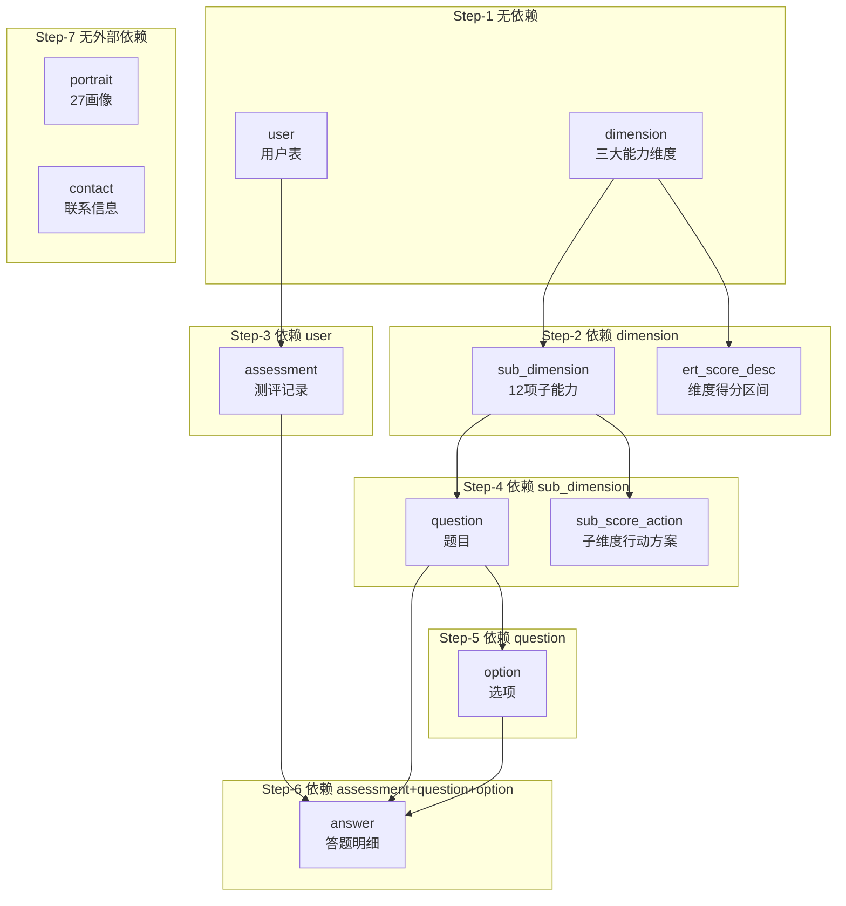
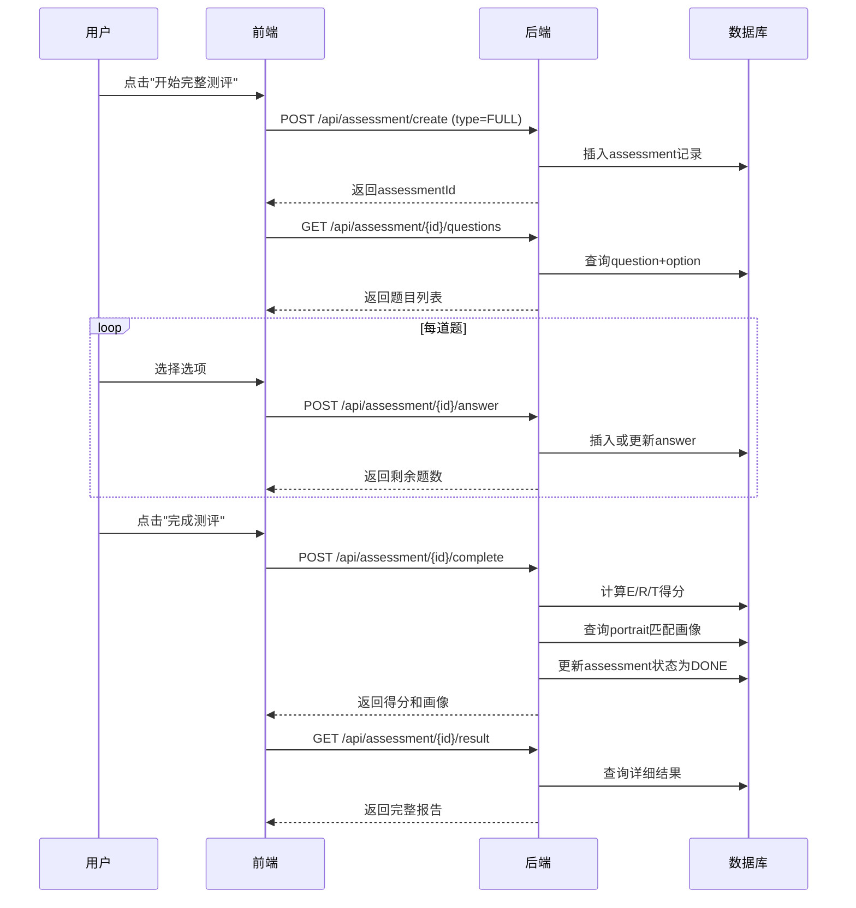
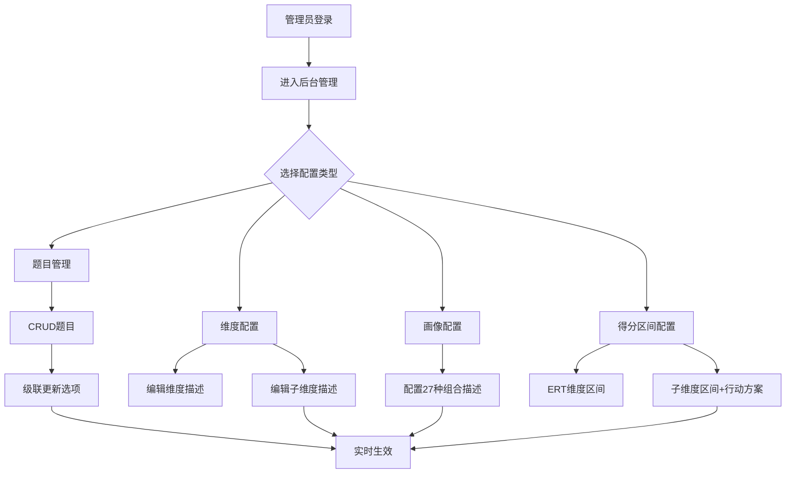
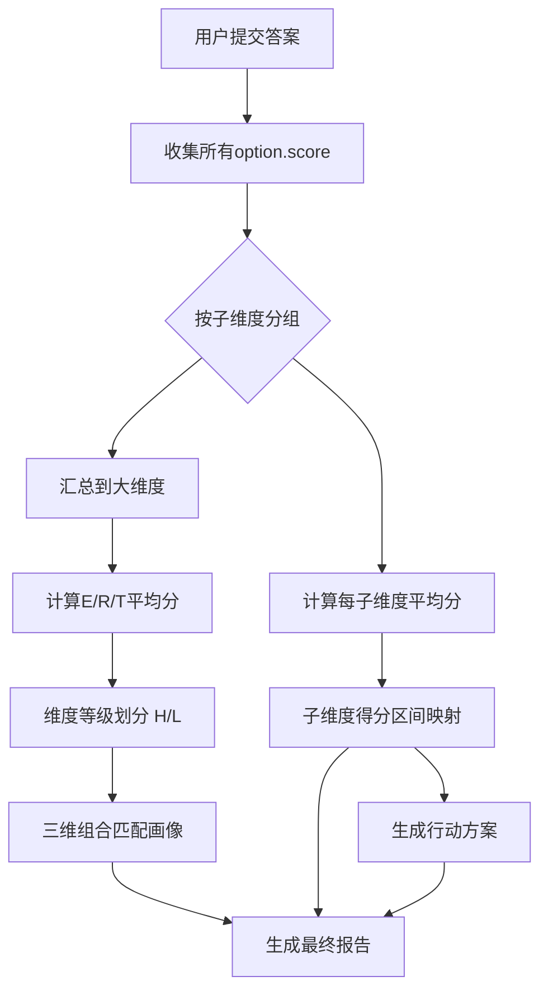

# OpenAPI definition


**简介**:OpenAPI definition


**HOST**:http://localhost:8912


**联系人**:


**Version**:v0


**接口路径**:/v3/api-docs/default


[TOC]


# 27项领导力画像配置


## 更新画像描述


**接口地址**:`/api/admin/portrait/{id}`


**请求方式**:`PUT`


**请求数据类型**:`application/x-www-form-urlencoded,application/json`


**响应数据类型**:`*/*`


**接口描述**:


**请求示例**:


```javascript
{
  "description": ""
}
```


**请求参数**:


| 参数名称 | 参数说明 | 请求类型    | 是否必须 | 数据类型 | schema |
| -------- | -------- | ----- | -------- | -------- | ------ |
|id||path|true|integer(int32)||
|updatePortraitDTO|UpdatePortraitDTO|body|true|UpdatePortraitDTO|UpdatePortraitDTO|
|&emsp;&emsp;description|画像描述（富文本）||false|string||


**响应状态**:


| 状态码 | 说明 | schema |
| -------- | -------- | ----- | 
|200|OK|ResultVoid|


**响应参数**:


| 参数名称 | 参数说明 | 类型 | schema |
| -------- | -------- | ----- |----- | 
|code|状态码|integer(int32)|integer(int32)|
|msg|错误信息|string||
|data|数据|object||


**响应示例**:
```javascript
{
	"code": 0,
	"msg": "",
	"data": {}
}
```


## 查询画像列表


**接口地址**:`/api/admin/portrait/list`


**请求方式**:`GET`


**请求数据类型**:`application/x-www-form-urlencoded`


**响应数据类型**:`*/*`


**接口描述**:


**请求参数**:


暂无


**响应状态**:


| 状态码 | 说明 | schema |
| -------- | -------- | ----- | 
|200|OK|ResultListPortraitVO|


**响应参数**:


| 参数名称 | 参数说明 | 类型 | schema |
| -------- | -------- | ----- |----- | 
|code|状态码|integer(int32)|integer(int32)|
|msg|错误信息|string||
|data|数据|array|PortraitVO|
|&emsp;&emsp;code|测评画像编码|string||
|&emsp;&emsp;description|测评画像名称|string||


**响应示例**:
```javascript
{
	"code": 0,
	"msg": "",
	"data": [
		{
			"code": "",
			"description": ""
		}
	]
}
```


# 测评流程模块


## 提交答案


**接口地址**:`/api/assessment/{assessmentId}/answer`


**请求方式**:`POST`


**请求数据类型**:`application/x-www-form-urlencoded,application/json`


**响应数据类型**:`*/*`


**接口描述**:<p>单题提交，支持返回剩余题数；重复提交同一题则覆盖答案</p>


**请求示例**:


```javascript
{
  "questionId": 0,
  "optionId": 0
}
```


**请求参数**:


| 参数名称 | 参数说明 | 请求类型    | 是否必须 | 数据类型 | schema |
| -------- | -------- | ----- | -------- | -------- | ------ |
|assessmentId||path|true|integer(int64)||
|answerDTO|AnswerDTO|body|true|AnswerDTO|AnswerDTO|
|&emsp;&emsp;questionId|问题ID||false|integer(int32)||
|&emsp;&emsp;optionId|选项ID||false|integer(int32)||


**响应状态**:


| 状态码 | 说明 | schema |
| -------- | -------- | ----- | 
|200|OK|ResultAnswerVO|


**响应参数**:


| 参数名称 | 参数说明 | 类型 | schema |
| -------- | -------- | ----- |----- | 
|code|状态码|integer(int32)|integer(int32)|
|msg|错误信息|string||
|data||AnswerVO|AnswerVO|
|&emsp;&emsp;assessmentId|测评记录ID|integer(int32)||
|&emsp;&emsp;questionId|问题ID|integer(int32)||
|&emsp;&emsp;answered|选项ID|boolean||
|&emsp;&emsp;remainQuestions|剩余问题数量|integer(int32)||


**响应示例**:
```javascript
{
	"code": 0,
	"msg": "",
	"data": {
		"assessmentId": 0,
		"questionId": 0,
		"answered": true,
		"remainQuestions": 0
	}
}
```


## 完成测评并计算得分


**接口地址**:`/api/assessment/{assessmentId}/complete`


**请求方式**:`POST`


**请求数据类型**:`application/x-www-form-urlencoded`


**响应数据类型**:`*/*`


**接口描述**:<p>必须答完所有题目才能调用，自动计算三大维度得分并匹配画像</p>


**请求参数**:


| 参数名称 | 参数说明 | 请求类型    | 是否必须 | 数据类型 | schema |
| -------- | -------- | ----- | -------- | -------- | ------ |
|assessmentId||path|true|integer(int64)||


**响应状态**:


| 状态码 | 说明 | schema |
| -------- | -------- | ----- | 
|200|OK|ResultCompleteVO|


**响应参数**:


| 参数名称 | 参数说明 | 类型 | schema |
| -------- | -------- | ----- |----- | 
|code|状态码|integer(int32)|integer(int32)|
|msg|错误信息|string||
|data||CompleteVO|CompleteVO|
|&emsp;&emsp;assessmentId|测评记录主键|integer(int32)||
|&emsp;&emsp;status|测评状态：INIT-进行中, DONE-已完成|string||
|&emsp;&emsp;portraitId|测评得分|integer(int32)||
|&emsp;&emsp;portraitDesc|测评报告|string||
|&emsp;&emsp;escore||integer(int32)||
|&emsp;&emsp;rscore||integer(int32)||
|&emsp;&emsp;tscore||integer(int32)||


**响应示例**:
```javascript
{
	"code": 0,
	"msg": "",
	"data": {
		"assessmentId": 0,
		"status": "",
		"portraitId": 0,
		"portraitDesc": "",
		"escore": 0,
		"rscore": 0,
		"tscore": 0
	}
}
```


## 获取测评题目


**接口地址**:`/api/assessment/{assessmentId}/questions`


**请求方式**:`POST`


**请求数据类型**:`application/x-www-form-urlencoded`


**响应数据类型**:`*/*`


**接口描述**:


**请求参数**:


| 参数名称 | 参数说明 | 请求类型    | 是否必须 | 数据类型 | schema |
| -------- | -------- | ----- | -------- | -------- | ------ |
|assessmentId||path|true|integer(int64)||


**响应状态**:


| 状态码 | 说明 | schema |
| -------- | -------- | ----- | 
|200|OK|ResultListGetQuestionsVO|


**响应参数**:


| 参数名称 | 参数说明 | 类型 | schema |
| -------- | -------- | ----- |----- | 
|code|状态码|integer(int32)|integer(int32)|
|msg|错误信息|string||
|data|数据|array|GetQuestionsVO|
|&emsp;&emsp;questionId|问题ID|integer(int32)||
|&emsp;&emsp;subDimCode|子维度代码|string||
|&emsp;&emsp;subDimName|子维度名称|string||
|&emsp;&emsp;content|问题内容|string||
|&emsp;&emsp;seq|问题顺序|integer(int32)||
|&emsp;&emsp;options|问题选项|array|Options|
|&emsp;&emsp;&emsp;&emsp;optionId|选项ID|integer(int32)||
|&emsp;&emsp;&emsp;&emsp;label|选项内容|string||
|&emsp;&emsp;&emsp;&emsp;score|选项分数|integer(int32)||
|&emsp;&emsp;&emsp;&emsp;seq|选项顺序|integer(int32)||


**响应示例**:
```javascript
{
	"code": 0,
	"msg": "",
	"data": [
		{
			"questionId": 0,
			"subDimCode": "",
			"subDimName": "",
			"content": "",
			"seq": 0,
			"options": [
				{
					"optionId": 0,
					"label": "",
					"score": 0,
					"seq": 0
				}
			]
		}
	]
}
```


## 获取测评结果详情


**接口地址**:`/api/assessment/{assessmentId}/result`


**请求方式**:`GET`


**请求数据类型**:`application/x-www-form-urlencoded`


**响应数据类型**:`*/*`


**接口描述**:


**请求参数**:


| 参数名称 | 参数说明 | 请求类型    | 是否必须 | 数据类型 | schema |
| -------- | -------- | ----- | -------- | -------- | ------ |
|assessmentId||path|true|integer(int64)||


**响应状态**:


| 状态码 | 说明 | schema |
| -------- | -------- | ----- | 
|200|OK|ResultResultVO|


**响应参数**:


| 参数名称 | 参数说明 | 类型 | schema |
| -------- | -------- | ----- |----- | 
|code|状态码|integer(int32)|integer(int32)|
|msg|错误信息|string||
|data||ResultVO|ResultVO|
|&emsp;&emsp;assessmentId|测评ID|integer(int32)||
|&emsp;&emsp;userName|用户ID|string||
|&emsp;&emsp;type|测评类型|string||
|&emsp;&emsp;completedAt|测评完成时间|string(date-time)||
|&emsp;&emsp;dimensionScores||DimensionScores|DimensionScores|
|&emsp;&emsp;&emsp;&emsp;t||T|T|
|&emsp;&emsp;&emsp;&emsp;&emsp;&emsp;score|测评得分|integer(int32)||
|&emsp;&emsp;&emsp;&emsp;&emsp;&emsp;level|测评得分等级|string||
|&emsp;&emsp;&emsp;&emsp;&emsp;&emsp;description|测评得分描述|string||
|&emsp;&emsp;&emsp;&emsp;r||R|R|
|&emsp;&emsp;&emsp;&emsp;&emsp;&emsp;score|测评得分|integer(int32)||
|&emsp;&emsp;&emsp;&emsp;&emsp;&emsp;level|测评得分等级|string||
|&emsp;&emsp;&emsp;&emsp;&emsp;&emsp;description|测评得分描述|string||
|&emsp;&emsp;&emsp;&emsp;e||E|E|
|&emsp;&emsp;&emsp;&emsp;&emsp;&emsp;score|测评得分|integer(int32)||
|&emsp;&emsp;&emsp;&emsp;&emsp;&emsp;level|测评得分等级|string||
|&emsp;&emsp;&emsp;&emsp;&emsp;&emsp;description|测评得分描述|string||
|&emsp;&emsp;portrait||PortraitVO|PortraitVO|
|&emsp;&emsp;&emsp;&emsp;code|测评画像编码|string||
|&emsp;&emsp;&emsp;&emsp;description|测评画像名称|string||
|&emsp;&emsp;subDimensionScores|测评子维度得分|array|SubDimensionScores|
|&emsp;&emsp;&emsp;&emsp;code|测评子维度编码|string||
|&emsp;&emsp;&emsp;&emsp;name|测评子维度名称|string||
|&emsp;&emsp;&emsp;&emsp;score|测评得分|integer(int32)||
|&emsp;&emsp;&emsp;&emsp;dimension|测评得分等级|string||
|&emsp;&emsp;&emsp;&emsp;actionPlan|测评得分描述|string||


**响应示例**:
```javascript
{
	"code": 0,
	"msg": "",
	"data": {
		"assessmentId": 0,
		"userName": "",
		"type": "",
		"completedAt": "",
		"dimensionScores": {
			"t": {
				"score": 0,
				"level": "",
				"description": ""
			},
			"r": {
				"score": 0,
				"level": "",
				"description": ""
			},
			"e": {
				"score": 0,
				"level": "",
				"description": ""
			}
		},
		"portrait": {
			"code": "",
			"description": ""
		},
		"subDimensionScores": [
			{
				"code": "",
				"name": "",
				"score": 0,
				"dimension": "",
				"actionPlan": ""
			}
		]
	}
}
```


## 创建测评记录


**接口地址**:`/api/assessment/create`


**请求方式**:`POST`


**请求数据类型**:`application/x-www-form-urlencoded,application/json`


**响应数据类型**:`*/*`


**接口描述**:<p>创建新的测评任务，极速测评随机抽取每子维度1题</p>


**请求示例**:


```javascript
{
  "type": ""
}
```


**请求参数**:


| 参数名称 | 参数说明 | 请求类型    | 是否必须 | 数据类型 | schema |
| -------- | -------- | ----- | -------- | -------- | ------ |
|createAssessmentDTO|CreateAssessmentDTO|body|true|CreateAssessmentDTO|CreateAssessmentDTO|
|&emsp;&emsp;type|测评类型：QUICK-极速测评(12题), FULL-完整测评(36题)||false|string||


**响应状态**:


| 状态码 | 说明 | schema |
| -------- | -------- | ----- | 
|200|OK|ResultCreateAssessmentVO|


**响应参数**:


| 参数名称 | 参数说明 | 类型 | schema |
| -------- | -------- | ----- |----- | 
|code|状态码|integer(int32)|integer(int32)|
|msg|错误信息|string||
|data||CreateAssessmentVO|CreateAssessmentVO|
|&emsp;&emsp;assessmentId|测评记录主键|integer(int64)||
|&emsp;&emsp;type|测评类型：QUICK-极速测评(12题), FULL-完整测评(36题)|string||
|&emsp;&emsp;status|测评状态：INIT-进行中, DONE-已完成|string||
|&emsp;&emsp;questionCount|测评题目数量|integer(int32)||


**响应示例**:
```javascript
{
	"code": 0,
	"msg": "",
	"data": {
		"assessmentId": 0,
		"type": "",
		"status": "",
		"questionCount": 0
	}
}
```


## 查询我的测评历史


**接口地址**:`/api/assessment/history`


**请求方式**:`GET`


**请求数据类型**:`application/x-www-form-urlencoded`


**响应数据类型**:`*/*`


**接口描述**:


**请求参数**:


| 参数名称 | 参数说明 | 请求类型    | 是否必须 | 数据类型 | schema |
| -------- | -------- | ----- | -------- | -------- | ------ |
|page||query|false|integer(int32)||
|pageSize||query|false|integer(int32)||


**响应状态**:


| 状态码 | 说明 | schema |
| -------- | -------- | ----- | 
|200|OK|ResultPageResult|


**响应参数**:


| 参数名称 | 参数说明 | 类型 | schema |
| -------- | -------- | ----- |----- | 
|code|状态码|integer(int32)|integer(int32)|
|msg|错误信息|string||
|data||PageResult|PageResult|
|&emsp;&emsp;total|总记录数|integer(int64)||
|&emsp;&emsp;records|当前页数据|array|object|


**响应示例**:
```javascript
{
	"code": 0,
	"msg": "",
	"data": {
		"total": 0,
		"records": []
	}
}
```


# 认证与用户模块


## 获取当前用户信息


**接口地址**:`/api/auth/current`


**请求方式**:`GET`


**请求数据类型**:`application/x-www-form-urlencoded`


**响应数据类型**:`*/*`


**接口描述**:


**请求参数**:


暂无


**响应状态**:


| 状态码 | 说明 | schema |
| -------- | -------- | ----- | 
|200|OK|ResultCurrentUserVO|


**响应参数**:


| 参数名称 | 参数说明 | 类型 | schema |
| -------- | -------- | ----- |----- | 
|code|状态码|integer(int32)|integer(int32)|
|msg|错误信息|string||
|data||CurrentUserVO|CurrentUserVO|
|&emsp;&emsp;id|用户主键|integer(int64)||
|&emsp;&emsp;mobile|手机号（唯一）|string||
|&emsp;&emsp;email|邮箱（唯一）|string||
|&emsp;&emsp;name|真实姓名|string||
|&emsp;&emsp;gender|性别：0 未知，1 男，2 女|integer(int32)||
|&emsp;&emsp;birthDate|出生日期|string(date)||
|&emsp;&emsp;status|账号状态：0 禁用，1 启用|integer(int32)||
|&emsp;&emsp;role|角色：USER/INST_ADMIN/SUPER_ADMIN|string||


**响应示例**:
```javascript
{
	"code": 0,
	"msg": "",
	"data": {
		"id": 0,
		"mobile": "",
		"email": "",
		"name": "",
		"gender": 0,
		"birthDate": "",
		"status": 0,
		"role": ""
	}
}
```


## 用户登录


**接口地址**:`/api/auth/login`


**请求方式**:`POST`


**请求数据类型**:`application/x-www-form-urlencoded,application/json`


**响应数据类型**:`*/*`


**接口描述**:<p>登录成功后返回JWT token，有效期待定</p>


**请求示例**:


```javascript
{
  "account": "",
  "password": ""
}
```


**请求参数**:


| 参数名称 | 参数说明 | 请求类型    | 是否必须 | 数据类型 | schema |
| -------- | -------- | ----- | -------- | -------- | ------ |
|loginDTO|LoginDTO|body|true|LoginDTO|LoginDTO|
|&emsp;&emsp;account|账号||false|string||
|&emsp;&emsp;password|密码||false|string||


**响应状态**:


| 状态码 | 说明 | schema |
| -------- | -------- | ----- | 
|200|OK|ResultLoginVO|


**响应参数**:


| 参数名称 | 参数说明 | 类型 | schema |
| -------- | -------- | ----- |----- | 
|code|状态码|integer(int32)|integer(int32)|
|msg|错误信息|string||
|data||LoginVO|LoginVO|
|&emsp;&emsp;token|JWT token|string||
|&emsp;&emsp;expiresIn|token过期时间|string||
|&emsp;&emsp;userInfo||UserInfo|UserInfo|
|&emsp;&emsp;&emsp;&emsp;id|用户ID|integer(int64)||
|&emsp;&emsp;&emsp;&emsp;name|用户名|string||
|&emsp;&emsp;&emsp;&emsp;role|用户角色|string||


**响应示例**:
```javascript
{
	"code": 0,
	"msg": "",
	"data": {
		"token": "",
		"expiresIn": "",
		"userInfo": {
			"id": 0,
			"name": "",
			"role": ""
		}
	}
}
```


## 用户注册


**接口地址**:`/api/auth/register`


**请求方式**:`POST`


**请求数据类型**:`application/x-www-form-urlencoded,application/json`


**响应数据类型**:`*/*`


**接口描述**:<p>新用户注册，密码需满足8位以上含字母数字</p>


**请求示例**:


```javascript
{
  "mobile": "",
  "email": "",
  "password": "",
  "name": "",
  "gender": 0,
  "birthDate": ""
}
```


**请求参数**:


| 参数名称 | 参数说明 | 请求类型    | 是否必须 | 数据类型 | schema |
| -------- | -------- | ----- | -------- | -------- | ------ |
|userDTO|用户信息DTO|body|true|UserDTO|UserDTO|
|&emsp;&emsp;mobile|手机号（唯一）||false|string||
|&emsp;&emsp;email|邮箱（唯一）||false|string||
|&emsp;&emsp;password|密码（bcrypt 加密）||false|string||
|&emsp;&emsp;name|真实姓名||false|string||
|&emsp;&emsp;gender|性别：0 未知，1 男，2 女||false|integer(int32)||
|&emsp;&emsp;birthDate|出生日期||false|string(date)||


**响应状态**:


| 状态码 | 说明 | schema |
| -------- | -------- | ----- | 
|200|OK|ResultUserVO|


**响应参数**:


| 参数名称 | 参数说明 | 类型 | schema |
| -------- | -------- | ----- |----- | 
|code|状态码|integer(int32)|integer(int32)|
|msg|错误信息|string||
|data||UserVO|UserVO|
|&emsp;&emsp;id|用户主键|integer(int64)||
|&emsp;&emsp;mobile|手机号（唯一）|string||
|&emsp;&emsp;email|邮箱（唯一）|string||
|&emsp;&emsp;name|真实姓名|string||
|&emsp;&emsp;role|角色：USER/INST_ADMIN/SUPER_ADMIN|string||


**响应示例**:
```javascript
{
	"code": 0,
	"msg": "",
	"data": {
		"id": 0,
		"mobile": "",
		"email": "",
		"name": "",
		"role": ""
	}
}
```


# 题目管理


## 创建题目


**接口地址**:`/api/admin/question`


**请求方式**:`POST`


**请求数据类型**:`application/x-www-form-urlencoded,application/json`


**响应数据类型**:`*/*`


**接口描述**:


**请求示例**:


```javascript
{
  "subDimCode": "",
  "content": "",
  "seq": 0
}
```


**请求参数**:


| 参数名称 | 参数说明 | 请求类型    | 是否必须 | 数据类型 | schema |
| -------- | -------- | ----- | -------- | -------- | ------ |
|createQuestionDTO|CreateQuestionDTO|body|true|CreateQuestionDTO|CreateQuestionDTO|
|&emsp;&emsp;subDimCode|子维度编码||false|string||
|&emsp;&emsp;content|题干||false|string||
|&emsp;&emsp;seq|排序||false|integer(int32)||


**响应状态**:


| 状态码 | 说明 | schema |
| -------- | -------- | ----- | 
|200|OK|ResultCreateQuestionVO|


**响应参数**:


| 参数名称 | 参数说明 | 类型 | schema |
| -------- | -------- | ----- |----- | 
|code|状态码|integer(int32)|integer(int32)|
|msg|错误信息|string||
|data||CreateQuestionVO|CreateQuestionVO|
|&emsp;&emsp;questionId|问题ID|integer(int64)||


**响应示例**:
```javascript
{
	"code": 0,
	"msg": "",
	"data": {
		"questionId": 0
	}
}
```


## 更新题目


**接口地址**:`/api/admin/question/{questionId}`


**请求方式**:`PUT`


**请求数据类型**:`application/x-www-form-urlencoded,application/json`


**响应数据类型**:`*/*`


**接口描述**:


**请求示例**:


```javascript
{
  "subDimCode": "",
  "content": "",
  "seq": 0
}
```


**请求参数**:


| 参数名称 | 参数说明 | 请求类型    | 是否必须 | 数据类型 | schema |
| -------- | -------- | ----- | -------- | -------- | ------ |
|questionId||path|true|integer(int64)||
|createQuestionDTO|CreateQuestionDTO|body|true|CreateQuestionDTO|CreateQuestionDTO|
|&emsp;&emsp;subDimCode|子维度编码||false|string||
|&emsp;&emsp;content|题干||false|string||
|&emsp;&emsp;seq|排序||false|integer(int32)||


**响应状态**:


| 状态码 | 说明 | schema |
| -------- | -------- | ----- | 
|200|OK|ResultVoid|


**响应参数**:


| 参数名称 | 参数说明 | 类型 | schema |
| -------- | -------- | ----- |----- | 
|code|状态码|integer(int32)|integer(int32)|
|msg|错误信息|string||
|data|数据|object||


**响应示例**:
```javascript
{
	"code": 0,
	"msg": "",
	"data": {}
}
```


## 删除题目


**接口地址**:`/api/admin/question/{questionId}`


**请求方式**:`DELETE`


**请求数据类型**:`application/x-www-form-urlencoded`


**响应数据类型**:`*/*`


**接口描述**:<p>级联删除关联的选项和答案数据</p>


**请求参数**:


| 参数名称 | 参数说明 | 请求类型    | 是否必须 | 数据类型 | schema |
| -------- | -------- | ----- | -------- | -------- | ------ |
|questionId||path|true|integer(int64)||


**响应状态**:


| 状态码 | 说明 | schema |
| -------- | -------- | ----- | 
|200|OK|ResultVoid|


**响应参数**:


| 参数名称 | 参数说明 | 类型 | schema |
| -------- | -------- | ----- |----- | 
|code|状态码|integer(int32)|integer(int32)|
|msg|错误信息|string||
|data|数据|object||


**响应示例**:
```javascript
{
	"code": 0,
	"msg": "",
	"data": {}
}
```


## 分页查询题目


**接口地址**:`/api/admin/question/page`


**请求方式**:`GET`


**请求数据类型**:`application/x-www-form-urlencoded`


**响应数据类型**:`*/*`


**接口描述**:


**请求参数**:


| 参数名称 | 参数说明 | 请求类型    | 是否必须 | 数据类型 | schema |
| -------- | -------- | ----- | -------- | -------- | ------ |
|page||query|false|integer(int32)||
|pageSize||query|false|integer(int32)||
|subDimCode||query|false|string||
|keyword||query|false|string||


**响应状态**:


| 状态码 | 说明 | schema |
| -------- | -------- | ----- | 
|200|OK|ResultPageResult|


**响应参数**:


| 参数名称 | 参数说明 | 类型 | schema |
| -------- | -------- | ----- |----- | 
|code|状态码|integer(int32)|integer(int32)|
|msg|错误信息|string||
|data||PageResult|PageResult|
|&emsp;&emsp;total|总记录数|integer(int64)||
|&emsp;&emsp;records|当前页数据|array|object|


**响应示例**:
```javascript
{
	"code": 0,
	"msg": "",
	"data": {
		"total": 0,
		"records": []
	}
}
```


# 维度配置管理


## 更新维度描述


**接口地址**:`/api/admin/dimension/{code}`


**请求方式**:`PUT`


**请求数据类型**:`application/x-www-form-urlencoded`


**响应数据类型**:`*/*`


**接口描述**:


**请求参数**:


| 参数名称 | 参数说明 | 请求类型    | 是否必须 | 数据类型 | schema |
| -------- | -------- | ----- | -------- | -------- | ------ |
|code||path|true|string||
|dimension||query|true|DimensionDTO|DimensionDTO|
|&emsp;&emsp;name|维度名称||false|string||
|&emsp;&emsp;description|维度说明（富文本）||false|string||


**响应状态**:


| 状态码 | 说明 | schema |
| -------- | -------- | ----- | 
|200|OK|ResultVoid|


**响应参数**:


| 参数名称 | 参数说明 | 类型 | schema |
| -------- | -------- | ----- |----- | 
|code|状态码|integer(int32)|integer(int32)|
|msg|错误信息|string||
|data|数据|object||


**响应示例**:
```javascript
{
	"code": 0,
	"msg": "",
	"data": {}
}
```


## 查询三大能力维度


**接口地址**:`/api/admin/dimension/list`


**请求方式**:`GET`


**请求数据类型**:`application/x-www-form-urlencoded`


**响应数据类型**:`*/*`


**接口描述**:


**请求参数**:


暂无


**响应状态**:


| 状态码 | 说明 | schema |
| -------- | -------- | ----- | 
|200|OK|ResultListDimensionVO|


**响应参数**:


| 参数名称 | 参数说明 | 类型 | schema |
| -------- | -------- | ----- |----- | 
|code|状态码|integer(int32)|integer(int32)|
|msg|错误信息|string||
|data|数据|array|DimensionVO|
|&emsp;&emsp;code|维度编码|string||
|&emsp;&emsp;name|维度名称|string||
|&emsp;&emsp;description|维度描述|string||
|&emsp;&emsp;subDimensionCount|子维度数量|integer(int32)||


**响应示例**:
```javascript
{
	"code": 0,
	"msg": "",
	"data": [
		{
			"code": "",
			"name": "",
			"description": "",
			"subDimensionCount": 0
		}
	]
}
```


# 系统配置管理


## 获取联系信息


**接口地址**:`/api/admin/contact`


**请求方式**:`GET`


**请求数据类型**:`application/x-www-form-urlencoded`


**响应数据类型**:`*/*`


**接口描述**:


**请求参数**:


暂无


**响应状态**:


| 状态码 | 说明 | schema |
| -------- | -------- | ----- | 
|200|OK|ResultContactVO|


**响应参数**:


| 参数名称 | 参数说明 | 类型 | schema |
| -------- | -------- | ----- |----- | 
|code|状态码|integer(int32)|integer(int32)|
|msg|错误信息|string||
|data||ContactVO|ContactVO|
|&emsp;&emsp;company|公司名称|string||
|&emsp;&emsp;phone|联系电话|string||
|&emsp;&emsp;email|联系邮箱|string||
|&emsp;&emsp;address|办公地址|string||


**响应示例**:
```javascript
{
	"code": 0,
	"msg": "",
	"data": {
		"company": "",
		"phone": "",
		"email": "",
		"address": ""
	}
}
```


## 更新联系信息


**接口地址**:`/api/admin/contact`


**请求方式**:`PUT`


**请求数据类型**:`application/x-www-form-urlencoded,application/json`


**响应数据类型**:`*/*`


**接口描述**:


**请求示例**:


```javascript
{
  "company": "",
  "phone": "",
  "email": "",
  "address": ""
}
```


**请求参数**:


| 参数名称 | 参数说明 | 请求类型    | 是否必须 | 数据类型 | schema |
| -------- | -------- | ----- | -------- | -------- | ------ |
|contactDTO|ContactDTO|body|true|ContactDTO|ContactDTO|
|&emsp;&emsp;company|公司名称||false|string||
|&emsp;&emsp;phone|联系电话||false|string||
|&emsp;&emsp;email|联系邮箱||false|string||
|&emsp;&emsp;address|办公地址||false|string||


**响应状态**:


| 状态码 | 说明 | schema |
| -------- | -------- | ----- | 
|200|OK|ResultVoid|


**响应参数**:


| 参数名称 | 参数说明 | 类型 | schema |
| -------- | -------- | ----- |----- | 
|code|状态码|integer(int32)|integer(int32)|
|msg|错误信息|string||
|data|数据|object||


**响应示例**:
```javascript
{
	"code": 0,
	"msg": "",
	"data": {}
}
```


# 用户管理


## 设置用户角色


**接口地址**:`/api/admin/user/{userId}/role`


**请求方式**:`PUT`


**请求数据类型**:`application/x-www-form-urlencoded`


**响应数据类型**:`*/*`


**接口描述**:


**请求参数**:


| 参数名称 | 参数说明 | 请求类型    | 是否必须 | 数据类型 | schema |
| -------- | -------- | ----- | -------- | -------- | ------ |
|userId||path|true|integer(int64)||
|role||query|true|string||


**响应状态**:


| 状态码 | 说明 | schema |
| -------- | -------- | ----- | 
|200|OK|ResultVoid|


**响应参数**:


| 参数名称 | 参数说明 | 类型 | schema |
| -------- | -------- | ----- |----- | 
|code|状态码|integer(int32)|integer(int32)|
|msg|错误信息|string||
|data|数据|object||


**响应示例**:
```javascript
{
	"code": 0,
	"msg": "",
	"data": {}
}
```


## 启用-禁用用户


**接口地址**:`/api/admin/user/{userId}/status`


**请求方式**:`PUT`


**请求数据类型**:`application/x-www-form-urlencoded`


**响应数据类型**:`*/*`


**接口描述**:


**请求参数**:


| 参数名称 | 参数说明 | 请求类型    | 是否必须 | 数据类型 | schema |
| -------- | -------- | ----- | -------- | -------- | ------ |
|userId||path|true|integer(int64)||
|status||query|true|integer(int32)||


**响应状态**:


| 状态码 | 说明 | schema |
| -------- | -------- | ----- | 
|200|OK|ResultVoid|


**响应参数**:


| 参数名称 | 参数说明 | 类型 | schema |
| -------- | -------- | ----- |----- | 
|code|状态码|integer(int32)|integer(int32)|
|msg|错误信息|string||
|data|数据|object||


**响应示例**:
```javascript
{
	"code": 0,
	"msg": "",
	"data": {}
}
```


## 分页查询用户列表


**接口地址**:`/api/admin/user/page`


**请求方式**:`GET`


**请求数据类型**:`application/x-www-form-urlencoded`


**响应数据类型**:`*/*`


**接口描述**:


**请求参数**:


| 参数名称 | 参数说明 | 请求类型    | 是否必须 | 数据类型 | schema |
| -------- | -------- | ----- | -------- | -------- | ------ |
|page||query|false|integer(int32)||
|pageSize||query|false|integer(int32)||
|status||query|false|string||
|role||query|false|string||
|keyword||query|false|string||


**响应状态**:


| 状态码 | 说明 | schema |
| -------- | -------- | ----- | 
|200|OK|ResultPageResult|


**响应参数**:


| 参数名称 | 参数说明 | 类型 | schema |
| -------- | -------- | ----- |----- | 
|code|状态码|integer(int32)|integer(int32)|
|msg|错误信息|string||
|data||PageResult|PageResult|
|&emsp;&emsp;total|总记录数|integer(int64)||
|&emsp;&emsp;records|当前页数据|array|object|


**响应示例**:
```javascript
{
	"code": 0,
	"msg": "",
	"data": {
		"total": 0,
		"records": []
	}
}
```


# 子维度配置管理


## 更新子维度


**接口地址**:`/api/admin/sub-dimension/{code}`


**请求方式**:`PUT`


**请求数据类型**:`application/x-www-form-urlencoded,application/json`


**响应数据类型**:`*/*`


**接口描述**:


**请求示例**:


```javascript
{
  "name": "",
  "description": ""
}
```


**请求参数**:


| 参数名称 | 参数说明 | 请求类型    | 是否必须 | 数据类型 | schema |
| -------- | -------- | ----- | -------- | -------- | ------ |
|code||query|true|string||
|subDimensionDTO|SubDimensionDTO|body|true|SubDimensionDTO|SubDimensionDTO|
|&emsp;&emsp;name|子维度名称||false|string||
|&emsp;&emsp;description|子维度说明||false|string||


**响应状态**:


| 状态码 | 说明 | schema |
| -------- | -------- | ----- | 
|200|OK|ResultVoid|


**响应参数**:


| 参数名称 | 参数说明 | 类型 | schema |
| -------- | -------- | ----- |----- | 
|code|状态码|integer(int32)|integer(int32)|
|msg|错误信息|string||
|data|数据|object||


**响应示例**:
```javascript
{
	"code": 0,
	"msg": "",
	"data": {}
}
```


## 查询子维度列表


**接口地址**:`/api/admin/sub-dimension/list`


**请求方式**:`GET`


**请求数据类型**:`application/x-www-form-urlencoded`


**响应数据类型**:`*/*`


**接口描述**:


**请求参数**:


| 参数名称 | 参数说明 | 请求类型    | 是否必须 | 数据类型 | schema |
| -------- | -------- | ----- | -------- | -------- | ------ |
|dimensionCode||query|false|string||


**响应状态**:


| 状态码 | 说明 | schema |
| -------- | -------- | ----- | 
|200|OK|ResultListSubDimensionVO|


**响应参数**:


| 参数名称 | 参数说明 | 类型 | schema |
| -------- | -------- | ----- |----- | 
|code|状态码|integer(int32)|integer(int32)|
|msg|错误信息|string||
|data|数据|array|SubDimensionVO|
|&emsp;&emsp;code|子维度编码，如 E1|string||
|&emsp;&emsp;dimensionCode|所属大维度|string||
|&emsp;&emsp;name|子维度名称|string||
|&emsp;&emsp;description|子维度说明|string||


**响应示例**:
```javascript
{
	"code": 0,
	"msg": "",
	"data": [
		{
			"code": "",
			"dimensionCode": "",
			"name": "",
			"description": ""
		}
	]
}
```


# 子维度行动方案管理


## 更新行动方案


**接口地址**:`/api/admin/sub-score-action/{id}`


**请求方式**:`PUT`


**请求数据类型**:`application/x-www-form-urlencoded,application/json`


**响应数据类型**:`*/*`


**接口描述**:


**请求示例**:


```javascript
{
  "minScore": 0,
  "maxScore": 0,
  "actionPlan": ""
}
```


**请求参数**:


| 参数名称 | 参数说明 | 请求类型    | 是否必须 | 数据类型 | schema |
| -------- | -------- | ----- | -------- | -------- | ------ |
|id||path|true|integer(int32)||
|updateSubScoreActionDTO|UpdateSubScoreActionDTO|body|true|UpdateSubScoreActionDTO|UpdateSubScoreActionDTO|
|&emsp;&emsp;minScore|区间下限||false|integer(int32)||
|&emsp;&emsp;maxScore|区间上限||false|integer(int32)||
|&emsp;&emsp;actionPlan|可执行的具体行动方案（富文本）||false|string||


**响应状态**:


| 状态码 | 说明 | schema |
| -------- | -------- | ----- | 
|200|OK|ResultVoid|


**响应参数**:


| 参数名称 | 参数说明 | 类型 | schema |
| -------- | -------- | ----- |----- | 
|code|状态码|integer(int32)|integer(int32)|
|msg|错误信息|string||
|data|数据|object||


**响应示例**:
```javascript
{
	"code": 0,
	"msg": "",
	"data": {}
}
```


## 查询行动方案


**接口地址**:`/api/admin/sub-score-action/list`


**请求方式**:`GET`


**请求数据类型**:`application/x-www-form-urlencoded`


**响应数据类型**:`*/*`


**接口描述**:


**请求参数**:


| 参数名称 | 参数说明 | 请求类型    | 是否必须 | 数据类型 | schema |
| -------- | -------- | ----- | -------- | -------- | ------ |
|subDimCode||query|false|string||


**响应状态**:


| 状态码 | 说明 | schema |
| -------- | -------- | ----- | 
|200|OK|ResultSubScoreActionVO|


**响应参数**:


| 参数名称 | 参数说明 | 类型 | schema |
| -------- | -------- | ----- |----- | 
|code|状态码|integer(int32)|integer(int32)|
|msg|错误信息|string||
|data||SubScoreActionVO|SubScoreActionVO|
|&emsp;&emsp;id|主键|integer(int32)||
|&emsp;&emsp;subDimCode|子维度编码|string||
|&emsp;&emsp;minScore|区间下限|integer(int32)||
|&emsp;&emsp;maxScore|区间上限|integer(int32)||
|&emsp;&emsp;actionPlan|可执行的具体行动方案（富文本）|string||


**响应示例**:
```javascript
{
	"code": 0,
	"msg": "",
	"data": {
		"id": 0,
		"subDimCode": "",
		"minScore": 0,
		"maxScore": 0,
		"actionPlan": ""
	}
}
```


# ERT得分区间管理


## 更新得分区间描述


**接口地址**:`/api/admin/ert-score-desc/{id}`


**请求方式**:`PUT`


**请求数据类型**:`application/x-www-form-urlencoded,application/json`


**响应数据类型**:`*/*`


**接口描述**:


**请求示例**:


```javascript
{
  "minScore": 0,
  "maxScore": 0,
  "description": ""
}
```


**请求参数**:


| 参数名称 | 参数说明 | 请求类型    | 是否必须 | 数据类型 | schema |
| -------- | -------- | ----- | -------- | -------- | ------ |
|id||path|true|integer(int32)||
|updateErtScoreDescDTO|UpdateErtScoreDescDTO|body|true|UpdateErtScoreDescDTO|UpdateErtScoreDescDTO|
|&emsp;&emsp;minScore|区间下限（含）||false|integer(int32)||
|&emsp;&emsp;maxScore|区间上限（含）||false|integer(int32)||
|&emsp;&emsp;description|区间文字描述||false|string||


**响应状态**:


| 状态码 | 说明 | schema |
| -------- | -------- | ----- | 
|200|OK|ResultVoid|


**响应参数**:


| 参数名称 | 参数说明 | 类型 | schema |
| -------- | -------- | ----- |----- | 
|code|状态码|integer(int32)|integer(int32)|
|msg|错误信息|string||
|data|数据|object||


**响应示例**:
```javascript
{
	"code": 0,
	"msg": "",
	"data": {}
}
```


## 查询得分区间


**接口地址**:`/api/admin/ert-score-desc/list`


**请求方式**:`GET`


**请求数据类型**:`application/x-www-form-urlencoded`


**响应数据类型**:`*/*`


**接口描述**:


**请求参数**:


暂无


**响应状态**:


| 状态码 | 说明 | schema |
| -------- | -------- | ----- | 
|200|OK|ResultListErtScoreDescVO|


**响应参数**:


| 参数名称 | 参数说明 | 类型 | schema |
| -------- | -------- | ----- |----- | 
|code|状态码|integer(int32)|integer(int32)|
|msg|错误信息|string||
|data|数据|array|ErtScoreDescVO|


**响应示例**:
```javascript
{
	"code": 0,
	"msg": "",
	"data": [
		{}
	]
}
```


# 附录


## 开发文档


### v1.0_开发需求
# v1.0_开发需求

## 开发需求

| 功能大类               | 子功能                          | 说明/入口                                                    |
| ---------------------- | ------------------------------- | ------------------------------------------------------------ |
| 门户页                 | 1. 门户页（移动端、PC端）       | 统一首页                                                     |
|                        | 2. 用户登录                     | 右上角【登录】按钮                                           |
|                        | 3. 注册                         | 右上角【注册】按钮                                           |
|                        | 4. 开始测评入口                 | 含以下三项                                                   |
|                        | 4.1 极速测评                    | 气泡框                                                       |
|                        | 4.2 完整测评                    | 气泡框                                                       |
|                        | 4.3 我的历史测评报告            | 气泡框                                                       |
| 登录页                 | 1. 收集测评用户个人信息         | Web 表单                                                     |
| 答题页面               | 1. 展示题目内容                 |                                                              |
|                        | 2. 收集用户答案                 |                                                              |
| 测评结果页             | 1. 展示测评整体结果             |                                                              |
|                        | 2. 总体定位                     | 领导力画像及三大能力图谱，按总得分展示分析                   |
|                        | 3. 子维度详情                   | 12 项能力强弱分析，按实际得分详细展示                        |
|                        | 4. 改善建议                     | 专属行动方案                                                 |
|                        | 5. 保存结果                     | 将测评结果保存为本地图片                                     |
| 特殊项                 | 1. 多端适配                     | 适配移动端，自适应 PC 端                                     |
| 用户管理               | 1. 可用性管理                   | 启用/禁用所有用户                                            |
|                        | 2. 配置机构/学校管理员          |                                                              |
| 分类题目管理           | 1. 题目内容的增、删、改、查     |                                                              |
| 三大能力配置管理       | 1. 展示并可编辑三大能力信息     |                                                              |
| 子能力配置管理         | 1. 展示并可编辑 12 项子能力信息 |                                                              |
| 27 项领导力画像        | 1. 配置描述                     | 按三大能力得分组合（如高高中、低中高）配置 27 项总体定位描述 |
| ERT 得分管理           | 1. 得分区间分析                 | 配置 E、R、T 三大能力得分对应区间的分析内容展示              |
| 子项得分及行动方案管理 | 1. 得分区间分析                 | 配置 12 项子能力得分对应区间的分析内容展示                   |
|                        | 2. 行动方案及建议               | 用于测评结果页“专属行动方案”展示                             |
| 历史测评结果页         | 1. 查看所有用户历史测评结果     |                                                              |
|                        | 2. 管理员保存结果               | 保存时添加公司名称、联系方式等，以图片形式保存至本地         |
| 联系我们配置项         | 1. 维护公司及联系方式信息       |                                                              |
| 门户页内容配置项       | 可配置标题                      | 1. 了解 ERT<br>2. 常见问题<br>3. 隐私政策<br>4. 使用条款<br>5. 应用指南 |

## 数据库详解


### v1.1_接口开发文档
# v1.1_接口开发文档

# ERT领导力测评系统 · 后端接口开发文档

## 一、全局约定

### 1.1 统一返回格式
所有接口均使用 `Result<T>` 封装，结构如下：
```json
{
  "code": 1,      // 1成功，0失败，-1未登录
  "msg": "错误信息",  // code≠1时返回
  "data": {}     // 具体业务数据
}
```

### 1.2 分页返回格式
分页接口使用 `PageResult` 封装：
```json
{
  "code": 1,
  "msg": null,
  "data": {
    "total": 100,
    "records": []
  }
}
```

### 1.3 认证机制
- 使用 JWT Token 认证，请求头携带：`Authorization: Bearer {token}`
- 管理员接口需额外校验角色：`role` 需为 `INST_ADMIN` 或 `SUPER_ADMIN`

---

## 二、认证与用户模块

### 2.1 用户注册
```http
POST /api/auth/register
```

**请求参数：**
```json
{
  "mobile": "13800000001",
  "email": "zhangsan@test.com",
  "password": "a12345678",
  "name": "张三",
  "gender": 1,
  "birthDate": "1990-01-01"
}
```

**返回结果：**
```json
{
  "code": 1,
  "msg": null,
  "data": {
    "id": 10001,
    "mobile": "13800000001",
    "email": "zhangsan@test.com",
    "name": "张三",
    "role": "USER"
  }
}
```

**接口说明：** 新用户注册，密码需满足8位以上含字母数字

---

### 2.2 用户登录
```http
POST /api/auth/login
```

**请求参数：**
```json
{
  "account": "13800000001",  // 手机或邮箱
  "password": "a12345678"
}
```

**返回结果：**
```json
{
  "code": 1,
  "msg": null,
  "data": {
    "token": "eyJhbGciOiJIUzI1NiJ9...",
    "expiresIn": 3600,
    "userInfo": {
      "id": 10001,
      "name": "张三",
      "role": "USER"
    }
  }
}
```

**接口说明：** 登录成功后返回JWT token，有效期1小时

---

### 2.3 获取当前用户信息
```http
GET /api/auth/current
```

**请求头：** `Authorization: Bearer {token}`

**返回结果：**
```json
{
  "code": 1,
  "msg": null,
  "data": {
    "id": 10001,
    "mobile": "13800000001",
    "email": "zhangsan@test.com",
    "name": "张三",
    "gender": 1,
    "birthDate": "1990-01-01",
    "status": 1,
    "role": "USER"
  }
}
```

---

## 三、测评流程模块

### 3.1 创建测评记录
```http
POST /api/assessment/create
```

**请求参数：**
```json
{
  "type": "QUICK"  // QUICK-极速测评(12题), FULL-完整测评(36题)
}
```

**请求头：** `Authorization: Bearer {token}`

**返回结果：**
```json
{
  "code": 1,
  "msg": null,
  "data": {
    "assessmentId": 20001,
    "type": "QUICK",
    "status": "INIT",
    "questionCount": 12
  }
}
```

**接口说明：** 创建新的测评任务，极速测评随机抽取每子维度1题

---

### 3.2 获取测评题目
```http
GET /api/assessment/{assessmentId}/questions
```

**路径参数：** `assessmentId` - 测评记录ID

**请求头：** `Authorization: Bearer {token}`

**返回结果：**
```json
{
  "code": 1,
  "msg": null,
  "data": [
    {
      "questionId": 30001,
      "subDimCode": "E1",
      "subDimName": "目标设定",
      "content": "我善于把愿景转化为可衡量的目标。",
      "seq": 1,
      "options": [
        {
          "optionId": 40001,
          "label": "非常不符合",
          "score": 1,
          "seq": 1
        },
        {
          "optionId": 40002,
          "label": "较不符合",
          "score": 2,
          "seq": 2
        },
        {
          "optionId": 40003,
          "label": "一般",
          "score": 3,
          "seq": 3
        },
        {
          "optionId": 40004,
          "label": "较符合",
          "score": 4,
          "seq": 4
        },
        {
          "optionId": 40005,
          "label": "非常符合",
          "score": 5,
          "seq": 5
        }
      ]
    }
  ]
}
```

---

### 3.3 提交答案
```http
POST /api/assessment/{assessmentId}/answer
```

**路径参数：** `assessmentId` - 测评记录ID

**请求参数：**
```json
{
  "questionId": 30001,
  "optionId": 40003
}
```

**请求头：** `Authorization: Bearer {token}`

**返回结果：**
```json
{
  "code": 1,
  "msg": null,
  "data": {
    "assessmentId": 20001,
    "questionId": 30001,
    "answered": true,
    "remainQuestions": 11
  }
}
```

**接口说明：** 单题提交，支持返回剩余题数；重复提交同一题则覆盖答案

---

### 3.4 完成测评并计算得分
```http
POST /api/assessment/{assessmentId}/complete
```

**路径参数：** `assessmentId` - 测评记录ID

**请求头：** `Authorization: Bearer {token}`

**返回结果：**
```json
{
  "code": 1,
  "msg": null,
  "data": {
    "assessmentId": 20001,
    "status": "DONE",
    "eScore": 85,
    "rScore": 72,
    "tScore": 90,
    "portraitId": 17,
    "portraitDesc": "卓越领导者：三高型..."
  }
}
```

**接口说明：** 必须答完所有题目才能调用，自动计算三大维度得分并匹配画像

---

### 3.5 获取测评结果详情
```http
GET /api/assessment/{assessmentId}/result
```

**路径参数：** `assessmentId` - 测评记录ID

**请求头：** `Authorization: Bearer {token}`

**返回结果：**
```json
{
  "code": 1,
  "msg": null,
  "data": {
    "assessmentId": 20001,
    "userName": "张三",
    "type": "FULL",
    "completedAt": "2024-01-15 14:30:00",
    "dimensionScores": {
      "E": {
        "score": 85,
        "level": "H",
        "description": "执行优秀：高结果导向，可辅导他人..."
      },
      "R": {
        "score": 72,
        "level": "H",
        "description": "关系中等：已能建立信任，需提升冲突管理..."
      },
      "T": {
        "score": 90,
        "level": "H",
        "description": "思考优秀：战略前瞻与系统洞察突出..."
      }
    },
    "portrait": {
      "code": "HHH",
      "description": "卓越领导者：三高型，执行力、关系力、思考力均衡突出..."
    },
    "subDimensionScores": [
      {
        "code": "E1",
        "name": "目标设定",
        "score": 78,
        "dimension": "E",
        "actionPlan": "成为团队 OKR 教练，帮助成员撰写关键结果..."
      }
      // ... 其他11个子维度
    ]
  }
}
```

---

## 四、管理后台模块

### 4.1 用户管理

#### 4.1.1 分页查询用户列表
```http
GET /api/admin/user/page?page=1&pageSize=10&status=1&role=USER
```

**查询参数：**
- `page`：页码，默认1
- `pageSize`：每页条数，默认10
- `status`：状态筛选（可选）
- `role`：角色筛选（可选）
- `keyword`：姓名/手机/邮箱模糊搜索（可选）

**返回结果：**
```json
{
  "code": 1,
  "msg": null,
  "data": {
    "total": 150,
    "records": [
      {
        "id": 10001,
        "mobile": "13800000001",
        "name": "张三",
        "status": 1,
        "role": "USER",
        "assessmentCount": 3
      }
    ]
  }
}
```

---

#### 4.1.2 启用/禁用用户
```http
PUT /api/admin/user/{userId}/status
```

**路径参数：** `userId` - 用户ID

**请求参数：**
```json
{
  "status": 0  // 0-禁用，1-启用
}
```

**返回结果：**
```json
{
  "code": 1,
  "msg": "操作成功",
  "data": null
}
```

---

#### 4.1.3 设置用户角色
```http
PUT /api/admin/user/{userId}/role
```

**路径参数：** `userId` - 用户ID

**请求参数：**
```json
{
  "role": "INST_ADMIN"  // USER/INST_ADMIN/SUPER_ADMIN
}
```

**返回结果：**
```json
{
  "code": 1,
  "msg": "角色设置成功",
  "data": null
}
```

---

### 4.2 题目管理

#### 4.2.1 分页查询题目
```http
GET /api/admin/question/page?page=1&pageSize=10&subDimCode=E1
```

**查询参数：**
- `subDimCode`：子维度编码筛选（可选）
- `keyword`：题干关键词搜索（可选）

**返回结果：**
```json
{
  "code": 1,
  "data": {
    "total": 36,
    "records": [
      {
        "id": 30001,
        "subDimCode": "E1",
        "subDimName": "目标设定",
        "content": "我善于把愿景转化为可衡量的目标。",
        "seq": 1,
        "optionCount": 5
      }
    ]
  }
}
```

---

#### 4.2.2 创建题目
```http
POST /api/admin/question
```

**请求参数：**
```json
{
  "subDimCode": "E1",
  "content": "我能够为团队设定挑战性但可达成的目标。",
  "seq": 4
}
```

**返回结果：**
```json
{
  "code": 1,
  "msg": "创建成功",
  "data": {
    "questionId": 30037
  }
}
```

---

#### 4.2.3 更新题目
```http
PUT /api/admin/question/{questionId}
```

**路径参数：** `questionId` - 题目ID

**请求参数：**
```json
{
  "subDimCode": "E1",
  "content": "我能够为团队设定挑战性但可达成的目标（已更新）。",
  "seq": 4
}
```

---

#### 4.2.4 删除题目
```http
DELETE /api/admin/question/{questionId}
```

**路径参数：** `questionId` - 题目ID

**接口说明：** 级联删除关联的选项和答案数据

---

### 4.3 维度配置管理

#### 4.3.1 查询三大能力维度
```http
GET /api/admin/dimension/list
```

**返回结果：**
```json
{
  "code": 1,
  "data": [
    {
      "code": "E",
      "name": "执行",
      "description": "执行力维度：目标设定、结果导向...",
      "subDimensionCount": 4
    }
  ]
}
```

---

#### 4.3.2 更新维度描述
```http
PUT /api/admin/dimension/{code}
```

**路径参数：** `code` - 维度编码(E/R/T)

**请求参数：**
```json
{
  "name": "执行",
  "description": "新描述内容（支持富文本）"
}
```

---

### 4.4 子维度配置管理

#### 4.4.1 查询子维度列表
```http
GET /api/admin/sub-dimension/list?dimensionCode=E
```

**查询参数：** `dimensionCode` - 父维度编码（可选）

**返回结果：**
```json
{
  "code": 1,
  "data": [
    {
      "code": "E1",
      "dimensionCode": "E",
      "name": "目标设定",
      "description": "能否清晰设定可衡量的目标"
    }
  ]
}
```

---

#### 4.4.2 更新子维度
```http
PUT /api/admin/sub-dimension/{code}
```

**路径参数：** `code` - 子维度编码

**请求参数：**
```json
{
  "name": "目标设定与拆解",
  "description": "新描述内容"
}
```

---

### 4.5 27项领导力画像配置

#### 4.5.1 查询画像列表
```http
GET /api/admin/portrait/list
```

**返回结果：**
```json
{
  "code": 1,
  "data": [
    {
      "id": 17,
      "code": "HHH",
      "eLevel": "H",
      "rLevel": "H",
      "tLevel": "H",
      "description": "卓越领导者：三高型..."
    }
  ]
}
```

---

#### 4.5.2 更新画像描述
```http
PUT /api/admin/portrait/{id}
```

**路径参数：** `id` - 画像主键

**请求参数：**
```json
{
  "description": "更新后的画像描述（支持富文本）"
}
```

---

### 4.6 ERT得分区间管理

#### 4.6.1 查询得分区间
```http
GET /api/admin/ert-score-desc/list?dimensionCode=E
```

**查询参数：** `dimensionCode` - 维度编码

**返回结果：**
```json
{
  "code": 1,
  "data": [
    {
      "id": 1,
      "dimensionCode": "E",
      "minScore": 0,
      "maxScore": 40,
      "description": "执行较弱：需从目标设定与计划推进开始系统提升"
    }
  ]
}
```

---

#### 4.6.2 更新得分区间描述
```http
PUT /api/admin/ert-score-desc/{id}
```

**路径参数：** `id` - 记录ID

**请求参数：**
```json
{
  "minScore": 0,
  "maxScore": 40,
  "description": "更新后的区间描述"
}
```

---

### 4.7 子维度行动方案管理

#### 4.7.1 查询行动方案
```http
GET /api/admin/sub-score-action/list?subDimCode=E1
```

**查询参数：** `subDimCode` - 子维度编码

**返回结果：**
```json
{
  "code": 1,
  "data": [
    {
      "id": 1,
      "subDimCode": "E1",
      "minScore": 0,
      "maxScore": 25,
      "actionPlan": "使用SMART工具每周设定1个微目标..."
    }
  ]
}
```

---

#### 4.7.2 更新行动方案
```http
PUT /api/admin/sub-score-action/{id}
```

**路径参数：** `id` - 记录ID

**请求参数：**
```json
{
  "minScore": 0,
  "maxScore": 25,
  "actionPlan": "更新后的行动方案（支持富文本）"
}
```

---

### 4.8 系统配置管理

#### 4.8.1 获取联系信息
```http
GET /api/admin/contact
```

**返回结果：**
```json
{
  "code": 1,
  "data": {
    "company": "ERT领导力研究院",
    "phone": "400-123-4567",
    "email": "support@ertleader.com",
    "address": "上海市浦东新区张江高科技园区700号"
  }
}
```

---

#### 4.8.2 更新联系信息
```http
PUT /api/admin/contact
```

**请求参数：**
```json
{
  "company": "ERT领导力研究院",
  "phone": "400-123-4567",
  "email": "support@ertleader.com",
  "address": "新地址"
}
```

---

## 五、历史测评记录模块

### 5.1 查询我的测评历史
```http
GET /api/assessment/history?page=1&pageSize=10
```

**请求头：** `Authorization: Bearer {token}`

**返回结果：**
```json
{
  "code": 1,
  "data": {
    "total": 5,
    "records": [
      {
        "assessmentId": 20001,
        "type": "FULL",
        "status": "DONE",
        "completedAt": "2024-01-15 14:30:00",
        "eScore": 85,
        "rScore": 72,
        "tScore": 90,
        "portraitCode": "HHH"
      }
    ]
  }
}
```

---

### 5.2 管理员查询所有测评记录
```http
GET /api/admin/assessment/page?page=1&pageSize=10&userId=10001
```

**查询参数：**
- `userId`：用户ID筛选（可选）
- `status`：状态筛选（可选）

**返回结果：**
```json
{
  "code": 1,
  "data": {
    "total": 500,
    "records": [
      {
        "assessmentId": 20001,
        "userName": "张三",
        "userMobile": "13800000001",
        "type": "FULL",
        "status": "DONE",
        "completedAt": "2024-01-15 14:30:00",
        "eScore": 85,
        "rScore": 72,
        "tScore": 90
      }
    ]
  }
}
```

---

## 六、核心业务流程图

### 6.1 完整测评流程（用户端）



---

### 6.2 管理员配置流程



---

### 6.3 测评得分计算逻辑



---

## 七、接口调用示例（前端）

### 7.1 完整测评流程代码示例
```javascript
// 1. 创建测评
const createResponse = await axios.post('/api/assessment/create', 
  { type: 'FULL' },
  { headers: { Authorization: `Bearer ${token}` } }
);
const assessmentId = createResponse.data.data.assessmentId;

// 2. 获取题目
const questionsResponse = await axios.get(
  `/api/assessment/${assessmentId}/questions`,
  { headers: { Authorization: `Bearer ${token}` } }
);
const questions = questionsResponse.data.data;

// 3. 循环答题
for (const q of questions) {
  await axios.post(`/api/assessment/${assessmentId}/answer`,
    { questionId: q.questionId, optionId: selectedOptionId },
    { headers: { Authorization: `Bearer ${token}` } }
  );
}

// 4. 完成测评
await axios.post(
  `/api/assessment/${assessmentId}/complete`,
  {},
  { headers: { Authorization: `Bearer ${token}` } }
);

// 5. 获取结果
const resultResponse = await axios.get(
  `/api/assessment/${assessmentId}/result`,
  { headers: { Authorization: `Bearer ${token}` } }
);
console.log(resultResponse.data.data);
```

---

## 八、重要业务规则

| 规则项 | 说明 |
|--------|------|
| **测评类型** | QUICK=12题（每子维度1题），FULL=36题（每子维度3题） |
| **得分范围** | 每道题1-5分，子维度得分=平均分，维度得分=子维度平均分 |
| **维度等级** | ≥60分为H(高)，<60分为L(低) |
| **画像匹配** | 根据E/R/T三维H/L组合，27种可能（3³） |
| **答案覆盖** | 同一测评同一题可重复提交，以最后一次为准 |
| **级联删除** | 删除题目会级联删除option和answer；删除用户会级联删除assessment和answer |
| **状态流转** | INIT(进行中) → DONE(已完成)，不可回退 |
| **数据权限** | 用户只能查看自己的测评，管理员可查看所有 |

---

## 九、错误码定义

| 错误码 | 说明 |
|--------|------|
| `1001` | 用户不存在 |
| `1002` | 密码错误 |
| `1003` | Token过期或无效 |
| `2001` | 测评不存在 |
| `2002` | 无权访问该测评 |
| `2003` | 题目未答完无法完成 |
| `3001` | 题目不存在 |
| `3002` | 选项不属于该题目 |
| `4001` | 无权访问管理员接口 |
| `5000` | 系统内部错误 |

---

## 十、接口版本管理

- **基础路径：** `/api/v1`
- **当前版本：** v1.0
- **文档版本：** v1.1_开发需求
