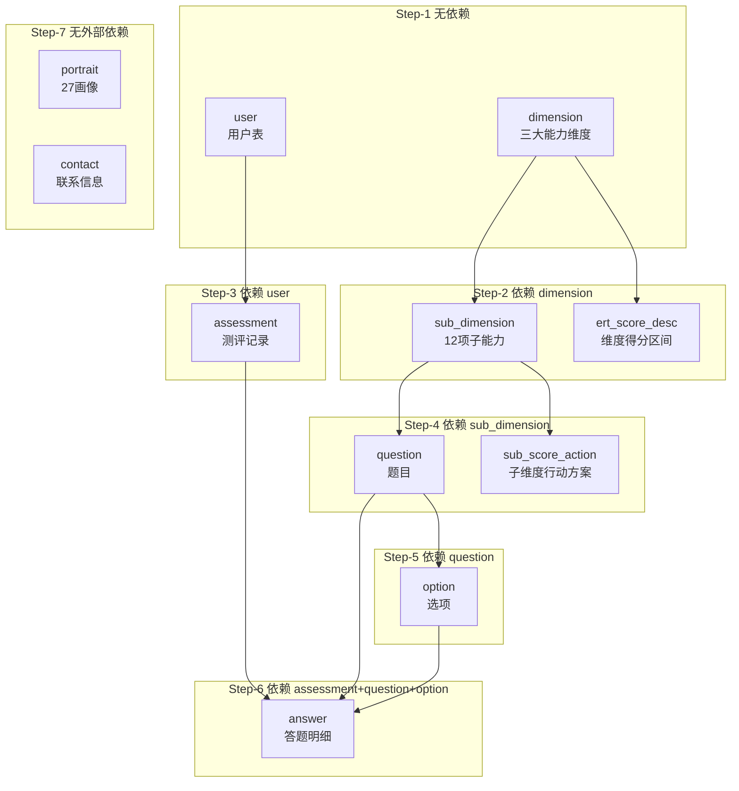

# v1.0_开发需求

## 开发需求

| 功能大类               | 子功能                          | 说明/入口                                                    |
| ---------------------- | ------------------------------- | ------------------------------------------------------------ |
| 门户页                 | 1. 门户页（移动端、PC端）       | 统一首页                                                     |
|                        | 2. 用户登录                     | 右上角【登录】按钮                                           |
|                        | 3. 注册                         | 右上角【注册】按钮                                           |
|                        | 4. 开始测评入口                 | 含以下三项                                                   |
|                        | 4.1 极速测评                    | 气泡框                                                       |
|                        | 4.2 完整测评                    | 气泡框                                                       |
|                        | 4.3 我的历史测评报告            | 气泡框                                                       |
| 登录页                 | 1. 收集测评用户个人信息         | Web 表单                                                     |
| 答题页面               | 1. 展示题目内容                 |                                                              |
|                        | 2. 收集用户答案                 |                                                              |
| 测评结果页             | 1. 展示测评整体结果             |                                                              |
|                        | 2. 总体定位                     | 领导力画像及三大能力图谱，按总得分展示分析                   |
|                        | 3. 子维度详情                   | 12 项能力强弱分析，按实际得分详细展示                        |
|                        | 4. 改善建议                     | 专属行动方案                                                 |
|                        | 5. 保存结果                     | 将测评结果保存为本地图片                                     |
| 特殊项                 | 1. 多端适配                     | 适配移动端，自适应 PC 端                                     |
| 用户管理               | 1. 可用性管理                   | 启用/禁用所有用户                                            |
|                        | 2. 配置机构/学校管理员          |                                                              |
| 分类题目管理           | 1. 题目内容的增、删、改、查     |                                                              |
| 三大能力配置管理       | 1. 展示并可编辑三大能力信息     |                                                              |
| 子能力配置管理         | 1. 展示并可编辑 12 项子能力信息 |                                                              |
| 27 项领导力画像        | 1. 配置描述                     | 按三大能力得分组合（如高高中、低中高）配置 27 项总体定位描述 |
| ERT 得分管理           | 1. 得分区间分析                 | 配置 E、R、T 三大能力得分对应区间的分析内容展示              |
| 子项得分及行动方案管理 | 1. 得分区间分析                 | 配置 12 项子能力得分对应区间的分析内容展示                   |
|                        | 2. 行动方案及建议               | 用于测评结果页“专属行动方案”展示                             |
| 历史测评结果页         | 1. 查看所有用户历史测评结果     |                                                              |
|                        | 2. 管理员保存结果               | 保存时添加公司名称、联系方式等，以图片形式保存至本地         |
| 联系我们配置项         | 1. 维护公司及联系方式信息       |                                                              |
| 门户页内容配置项       | 可配置标题                      | 1. 了解 ERT 2. 常见问题 3. 隐私政策 4. 使用条款 5. 应用指南 |

## 数据库详解

