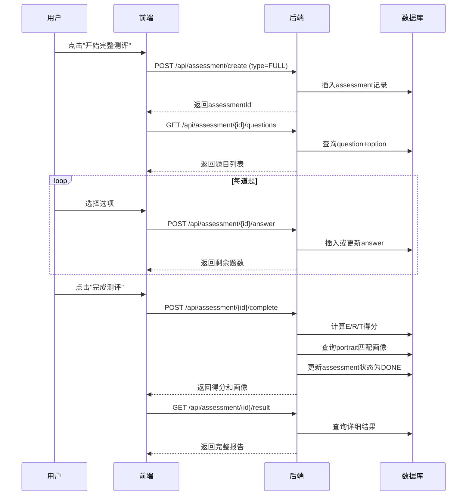
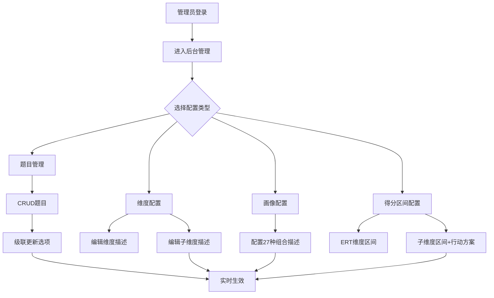
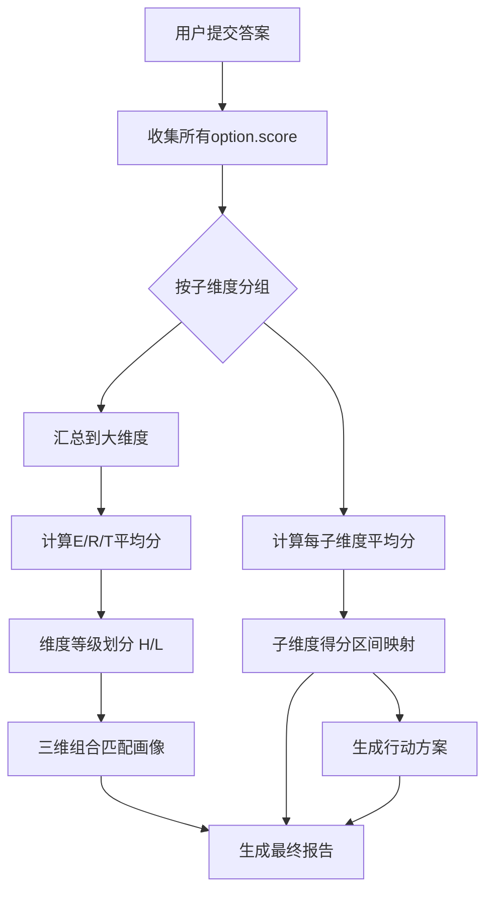

# v1.1_开发需求

# ERT领导力测评系统 · 后端接口开发文档

## 一、全局约定

### 1.1 统一返回格式
所有接口均使用 `Result<T>` 封装，结构如下：
```json
{
  "code": 1,      // 1成功，0失败，-1未登录
  "msg": "错误信息",  // code≠1时返回
  "data": {}     // 具体业务数据
}
```

### 1.2 分页返回格式
分页接口使用 `PageResult` 封装：
```json
{
  "code": 1,
  "msg": null,
  "data": {
    "total": 100,
    "records": []
  }
}
```

### 1.3 认证机制
- 使用 JWT Token 认证，请求头携带：`Authorization: Bearer {token}`
- 管理员接口需额外校验角色：`role` 需为 `INST_ADMIN` 或 `SUPER_ADMIN`

---

## 二、认证与用户模块

### 2.1 用户注册
```http
POST /api/auth/register
```

**请求参数：**
```json
{
  "mobile": "13800000001",
  "email": "zhangsan@test.com",
  "password": "a12345678",
  "name": "张三",
  "gender": 1,
  "birthDate": "1990-01-01"
}
```

**返回结果：**
```json
{
  "code": 1,
  "msg": null,
  "data": {
    "id": 10001,
    "mobile": "13800000001",
    "email": "zhangsan@test.com",
    "name": "张三",
    "role": "USER"
  }
}
```

**接口说明：** 新用户注册，密码需满足8位以上含字母数字

---

### 2.2 用户登录
```http
POST /api/auth/login
```

**请求参数：**
```json
{
  "account": "13800000001",  // 手机或邮箱
  "password": "a12345678"
}
```

**返回结果：**
```json
{
  "code": 1,
  "msg": null,
  "data": {
    "token": "eyJhbGciOiJIUzI1NiJ9...",
    "expiresIn": 3600,
    "userInfo": {
      "id": 10001,
      "name": "张三",
      "role": "USER"
    }
  }
}
```

**接口说明：** 登录成功后返回JWT token，有效期1小时

---

### 2.3 获取当前用户信息
```http
GET /api/auth/current
```

**请求头：** `Authorization: Bearer {token}`

**返回结果：**
```json
{
  "code": 1,
  "msg": null,
  "data": {
    "id": 10001,
    "mobile": "13800000001",
    "email": "zhangsan@test.com",
    "name": "张三",
    "gender": 1,
    "birthDate": "1990-01-01",
    "status": 1,
    "role": "USER"
  }
}
```

---

## 三、测评流程模块

### 3.1 创建测评记录
```http
POST /api/assessment/create
```

**请求参数：**
```json
{
  "type": "QUICK"  // QUICK-极速测评(12题), FULL-完整测评(36题)
}
```

**请求头：** `Authorization: Bearer {token}`

**返回结果：**
```json
{
  "code": 1,
  "msg": null,
  "data": {
    "assessmentId": 20001,
    "type": "QUICK",
    "status": "INIT",
    "questionCount": 12
  }
}
```

**接口说明：** 创建新的测评任务，极速测评随机抽取每子维度1题

---

### 3.2 获取测评题目
```http
GET /api/assessment/{assessmentId}/questions
```

**路径参数：** `assessmentId` - 测评记录ID

**请求头：** `Authorization: Bearer {token}`

**返回结果：**
```json
{
  "code": 1,
  "msg": null,
  "data": [
    {
      "questionId": 30001,
      "subDimCode": "E1",
      "subDimName": "目标设定",
      "content": "我善于把愿景转化为可衡量的目标。",
      "seq": 1,
      "options": [
        {
          "optionId": 40001,
          "label": "非常不符合",
          "score": 1,
          "seq": 1
        },
        {
          "optionId": 40002,
          "label": "较不符合",
          "score": 2,
          "seq": 2
        },
        {
          "optionId": 40003,
          "label": "一般",
          "score": 3,
          "seq": 3
        },
        {
          "optionId": 40004,
          "label": "较符合",
          "score": 4,
          "seq": 4
        },
        {
          "optionId": 40005,
          "label": "非常符合",
          "score": 5,
          "seq": 5
        }
      ]
    }
  ]
}
```

---

### 3.3 提交答案
```http
POST /api/assessment/{assessmentId}/answer
```

**路径参数：** `assessmentId` - 测评记录ID

**请求参数：**
```json
{
  "questionId": 30001,
  "optionId": 40003
}
```

**请求头：** `Authorization: Bearer {token}`

**返回结果：**
```json
{
  "code": 1,
  "msg": null,
  "data": {
    "assessmentId": 20001,
    "questionId": 30001,
    "answered": true,
    "remainQuestions": 11
  }
}
```

**接口说明：** 单题提交，支持返回剩余题数；重复提交同一题则覆盖答案

---

### 3.4 完成测评并计算得分
```http
POST /api/assessment/{assessmentId}/complete
```

**路径参数：** `assessmentId` - 测评记录ID

**请求头：** `Authorization: Bearer {token}`

**返回结果：**
```json
{
  "code": 1,
  "msg": null,
  "data": {
    "assessmentId": 20001,
    "status": "DONE",
    "eScore": 85,
    "rScore": 72,
    "tScore": 90,
    "portraitId": 17,
    "portraitDesc": "卓越领导者：三高型..."
  }
}
```

**接口说明：** 必须答完所有题目才能调用，自动计算三大维度得分并匹配画像

---

### 3.5 获取测评结果详情
```http
GET /api/assessment/{assessmentId}/result
```

**路径参数：** `assessmentId` - 测评记录ID

**请求头：** `Authorization: Bearer {token}`

**返回结果：**
```json
{
  "code": 1,
  "msg": null,
  "data": {
    "assessmentId": 20001,
    "userName": "张三",
    "type": "FULL",
    "completedAt": "2024-01-15 14:30:00",
    "dimensionScores": {
      "E": {
        "score": 85,
        "level": "H",
        "description": "执行优秀：高结果导向，可辅导他人..."
      },
      "R": {
        "score": 72,
        "level": "H",
        "description": "关系中等：已能建立信任，需提升冲突管理..."
      },
      "T": {
        "score": 90,
        "level": "H",
        "description": "思考优秀：战略前瞻与系统洞察突出..."
      }
    },
    "portrait": {
      "code": "HHH",
      "description": "卓越领导者：三高型，执行力、关系力、思考力均衡突出..."
    },
    "subDimensionScores": [
      {
        "code": "E1",
        "name": "目标设定",
        "score": 78,
        "dimension": "E",
        "actionPlan": "成为团队 OKR 教练，帮助成员撰写关键结果..."
      }
      // ... 其他11个子维度
    ]
  }
}
```

---

## 四、管理后台模块

### 4.1 用户管理

#### 4.1.1 分页查询用户列表
```http
GET /api/admin/user/page?page=1&pageSize=10&status=1&role=USER
```

**查询参数：**
- `page`：页码，默认1
- `pageSize`：每页条数，默认10
- `status`：状态筛选（可选）
- `role`：角色筛选（可选）
- `keyword`：姓名/手机/邮箱模糊搜索（可选）

**返回结果：**
```json
{
  "code": 1,
  "msg": null,
  "data": {
    "total": 150,
    "records": [
      {
        "id": 10001,
        "mobile": "13800000001",
        "name": "张三",
        "status": 1,
        "role": "USER",
        "assessmentCount": 3
      }
    ]
  }
}
```

---

#### 4.1.2 启用/禁用用户
```http
PUT /api/admin/user/{userId}/status
```

**路径参数：** `userId` - 用户ID

**请求参数：**
```json
{
  "status": 0  // 0-禁用，1-启用
}
```

**返回结果：**
```json
{
  "code": 1,
  "msg": "操作成功",
  "data": null
}
```

---

#### 4.1.3 设置用户角色
```http
PUT /api/admin/user/{userId}/role
```

**路径参数：** `userId` - 用户ID

**请求参数：**
```json
{
  "role": "INST_ADMIN"  // USER/INST_ADMIN/SUPER_ADMIN
}
```

**返回结果：**
```json
{
  "code": 1,
  "msg": "角色设置成功",
  "data": null
}
```

---

### 4.2 题目管理

#### 4.2.1 分页查询题目
```http
GET /api/admin/question/page?page=1&pageSize=10&subDimCode=E1
```

**查询参数：**
- `subDimCode`：子维度编码筛选（可选）
- `keyword`：题干关键词搜索（可选）

**返回结果：**
```json
{
  "code": 1,
  "data": {
    "total": 36,
    "records": [
      {
        "id": 30001,
        "subDimCode": "E1",
        "subDimName": "目标设定",
        "content": "我善于把愿景转化为可衡量的目标。",
        "seq": 1,
        "optionCount": 5
      }
    ]
  }
}
```

---

#### 4.2.2 创建题目
```http
POST /api/admin/question
```

**请求参数：**
```json
{
  "subDimCode": "E1",
  "content": "我能够为团队设定挑战性但可达成的目标。",
  "seq": 4
}
```

**返回结果：**
```json
{
  "code": 1,
  "msg": "创建成功",
  "data": {
    "questionId": 30037
  }
}
```

---

#### 4.2.3 更新题目
```http
PUT /api/admin/question/{questionId}
```

**路径参数：** `questionId` - 题目ID

**请求参数：**
```json
{
  "subDimCode": "E1",
  "content": "我能够为团队设定挑战性但可达成的目标（已更新）。",
  "seq": 4
}
```

---

#### 4.2.4 删除题目
```http
DELETE /api/admin/question/{questionId}
```

**路径参数：** `questionId` - 题目ID

**接口说明：** 级联删除关联的选项和答案数据

---

### 4.3 维度配置管理

#### 4.3.1 查询三大能力维度
```http
GET /api/admin/dimension/list
```

**返回结果：**
```json
{
  "code": 1,
  "data": [
    {
      "code": "E",
      "name": "执行",
      "description": "执行力维度：目标设定、结果导向...",
      "subDimensionCount": 4
    }
  ]
}
```

---

#### 4.3.2 更新维度描述
```http
PUT /api/admin/dimension/{code}
```

**路径参数：** `code` - 维度编码(E/R/T)

**请求参数：**
```json
{
  "name": "执行",
  "description": "新描述内容（支持富文本）"
}
```

---

### 4.4 子维度配置管理

#### 4.4.1 查询子维度列表
```http
GET /api/admin/sub-dimension/list?dimensionCode=E
```

**查询参数：** `dimensionCode` - 父维度编码（可选）

**返回结果：**
```json
{
  "code": 1,
  "data": [
    {
      "code": "E1",
      "dimensionCode": "E",
      "name": "目标设定",
      "description": "能否清晰设定可衡量的目标"
    }
  ]
}
```

---

#### 4.4.2 更新子维度
```http
PUT /api/admin/sub-dimension/{code}
```

**路径参数：** `code` - 子维度编码

**请求参数：**
```json
{
  "name": "目标设定与拆解",
  "description": "新描述内容"
}
```

---

### 4.5 27项领导力画像配置

#### 4.5.1 查询画像列表
```http
GET /api/admin/portrait/list
```

**返回结果：**
```json
{
  "code": 1,
  "data": [
    {
      "id": 17,
      "code": "HHH",
      "eLevel": "H",
      "rLevel": "H",
      "tLevel": "H",
      "description": "卓越领导者：三高型..."
    }
  ]
}
```

---

#### 4.5.2 更新画像描述
```http
PUT /api/admin/portrait/{id}
```

**路径参数：** `id` - 画像主键

**请求参数：**
```json
{
  "description": "更新后的画像描述（支持富文本）"
}
```

---

### 4.6 ERT得分区间管理

#### 4.6.1 查询得分区间
```http
GET /api/admin/ert-score-desc/list?dimensionCode=E
```

**查询参数：** `dimensionCode` - 维度编码

**返回结果：**
```json
{
  "code": 1,
  "data": [
    {
      "id": 1,
      "dimensionCode": "E",
      "minScore": 0,
      "maxScore": 40,
      "description": "执行较弱：需从目标设定与计划推进开始系统提升"
    }
  ]
}
```

---

#### 4.6.2 更新得分区间描述
```http
PUT /api/admin/ert-score-desc/{id}
```

**路径参数：** `id` - 记录ID

**请求参数：**
```json
{
  "minScore": 0,
  "maxScore": 40,
  "description": "更新后的区间描述"
}
```

---

### 4.7 子维度行动方案管理

#### 4.7.1 查询行动方案
```http
GET /api/admin/sub-score-action/list?subDimCode=E1
```

**查询参数：** `subDimCode` - 子维度编码

**返回结果：**
```json
{
  "code": 1,
  "data": [
    {
      "id": 1,
      "subDimCode": "E1",
      "minScore": 0,
      "maxScore": 25,
      "actionPlan": "使用SMART工具每周设定1个微目标..."
    }
  ]
}
```

---

#### 4.7.2 更新行动方案
```http
PUT /api/admin/sub-score-action/{id}
```

**路径参数：** `id` - 记录ID

**请求参数：**
```json
{
  "minScore": 0,
  "maxScore": 25,
  "actionPlan": "更新后的行动方案（支持富文本）"
}
```

---

### 4.8 系统配置管理

#### 4.8.1 获取联系信息
```http
GET /api/admin/contact
```

**返回结果：**
```json
{
  "code": 1,
  "data": {
    "company": "ERT领导力研究院",
    "phone": "400-123-4567",
    "email": "support@ertleader.com",
    "address": "上海市浦东新区张江高科技园区700号"
  }
}
```

---

#### 4.8.2 更新联系信息
```http
PUT /api/admin/contact
```

**请求参数：**
```json
{
  "company": "ERT领导力研究院",
  "phone": "400-123-4567",
  "email": "support@ertleader.com",
  "address": "新地址"
}
```

---

## 五、历史测评记录模块

### 5.1 查询我的测评历史
```http
GET /api/assessment/history?page=1&pageSize=10
```

**请求头：** `Authorization: Bearer {token}`

**返回结果：**
```json
{
  "code": 1,
  "data": {
    "total": 5,
    "records": [
      {
        "assessmentId": 20001,
        "type": "FULL",
        "status": "DONE",
        "completedAt": "2024-01-15 14:30:00",
        "eScore": 85,
        "rScore": 72,
        "tScore": 90,
        "portraitCode": "HHH"
      }
    ]
  }
}
```

---

### 5.2 管理员查询所有测评记录
```http
GET /api/admin/assessment/page?page=1&pageSize=10&userId=10001
```

**查询参数：**
- `userId`：用户ID筛选（可选）
- `status`：状态筛选（可选）

**返回结果：**
```json
{
  "code": 1,
  "data": {
    "total": 500,
    "records": [
      {
        "assessmentId": 20001,
        "userName": "张三",
        "userMobile": "13800000001",
        "type": "FULL",
        "status": "DONE",
        "completedAt": "2024-01-15 14:30:00",
        "eScore": 85,
        "rScore": 72,
        "tScore": 90
      }
    ]
  }
}
```

---

## 六、核心业务流程图

### 6.1 完整测评流程（用户端）



---

### 6.2 管理员配置流程



---

### 6.3 测评得分计算逻辑



---

## 七、接口调用示例（前端）

### 7.1 完整测评流程代码示例
```javascript
// 1. 创建测评
const createResponse = await axios.post('/api/assessment/create', 
  { type: 'FULL' },
  { headers: { Authorization: `Bearer ${token}` } }
);
const assessmentId = createResponse.data.data.assessmentId;

// 2. 获取题目
const questionsResponse = await axios.get(
  `/api/assessment/${assessmentId}/questions`,
  { headers: { Authorization: `Bearer ${token}` } }
);
const questions = questionsResponse.data.data;

// 3. 循环答题
for (const q of questions) {
  await axios.post(`/api/assessment/${assessmentId}/answer`,
    { questionId: q.questionId, optionId: selectedOptionId },
    { headers: { Authorization: `Bearer ${token}` } }
  );
}

// 4. 完成测评
await axios.post(
  `/api/assessment/${assessmentId}/complete`,
  {},
  { headers: { Authorization: `Bearer ${token}` } }
);

// 5. 获取结果
const resultResponse = await axios.get(
  `/api/assessment/${assessmentId}/result`,
  { headers: { Authorization: `Bearer ${token}` } }
);
console.log(resultResponse.data.data);
```

---

## 八、重要业务规则

| 规则项 | 说明 |
|--------|------|
| **测评类型** | QUICK=12题（每子维度1题），FULL=36题（每子维度3题） |
| **得分范围** | 每道题1-5分，子维度得分=平均分，维度得分=子维度平均分 |
| **维度等级** | ≥60分为H(高)，<60分为L(低) |
| **画像匹配** | 根据E/R/T三维H/L组合，27种可能（3³） |
| **答案覆盖** | 同一测评同一题可重复提交，以最后一次为准 |
| **级联删除** | 删除题目会级联删除option和answer；删除用户会级联删除assessment和answer |
| **状态流转** | INIT(进行中) → DONE(已完成)，不可回退 |
| **数据权限** | 用户只能查看自己的测评，管理员可查看所有 |

---

## 九、错误码定义

| 错误码 | 说明 |
|--------|------|
| `1001` | 用户不存在 |
| `1002` | 密码错误 |
| `1003` | Token过期或无效 |
| `2001` | 测评不存在 |
| `2002` | 无权访问该测评 |
| `2003` | 题目未答完无法完成 |
| `3001` | 题目不存在 |
| `3002` | 选项不属于该题目 |
| `4001` | 无权访问管理员接口 |
| `5000` | 系统内部错误 |

---

## 十、接口版本管理

- **基础路径：** `/api/v1`
- **当前版本：** v1.0
- **文档版本：** v1.1_开发需求
